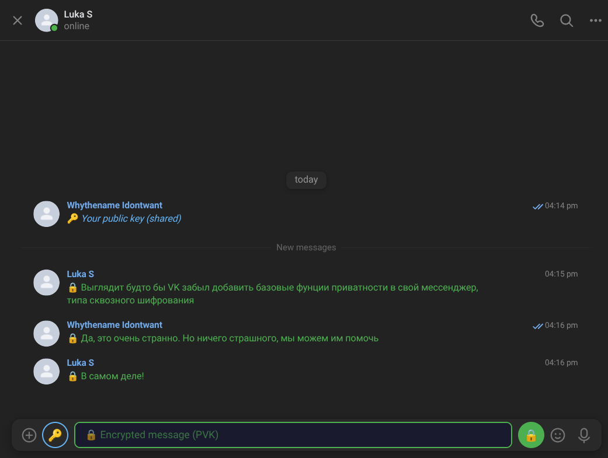
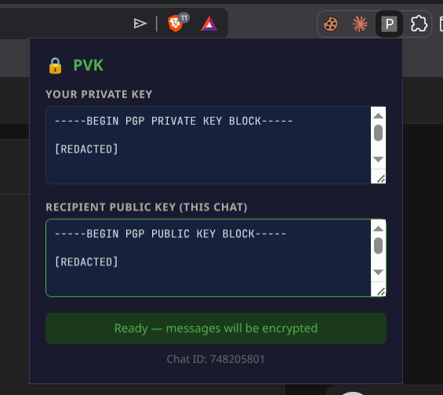

# PVK - Basic privacy for VK

Аддон для VK который добавляет сквозное шифрование в простом gpg armor формате прямо поверх сообщений.

Скорее proof of concept чем готовый продукт, тем не менее есть полная работоспособность.

В ситуации белых списков может послужить выходом для приватного общения через VK или MAX (пока нет поддержки).

## Скриншоты

## Установка

Расширение не опубликовано, поэтому установка только из исходного кода. Для этого скачайте этот репозиторий, зайдите на страницу расширений вашего браузера (что-то вроде chrome://extensions/), и нажмите Load Unpacked - затем укажите папку куда вы скачали код.
